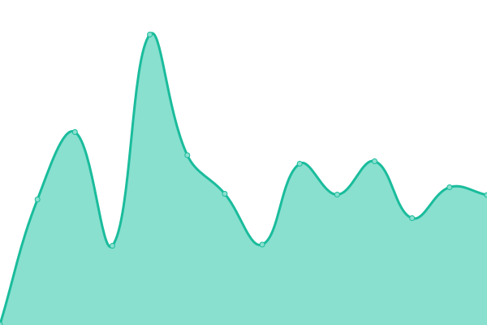

# [📈 Live Status](https://status.envesko.cloud): <!--live status--> **🟥 Complete outage**

<!--start: status pages-->
<!-- This summary is generated by Upptime (https://github.com/upptime/upptime) -->
<!-- Do not edit this manually, your changes will be overwritten -->
<!-- prettier-ignore -->
| URL | Status | History | Response Time | Uptime |
| --- | ------ | ------- | ------------- | ------ |
|  [Envesko Cloud - HTTPS](https://envesko.cloud) | 🟥 Down | [envesko-cloud-https.yml](https://github.com/envesko/status-ec/commits/HEAD/history/envesko-cloud-https.yml) | 

 332ms
     
 | 

<a href="https://status.envesko.cloud/history/envesko-cloud-https">99.25%</a>
    

|  [Song Command API](https://envesko.cloud/api/esm/spotify/get-current-song) | 🟥 Down | [song-command-api.yml](https://github.com/envesko/status-ec/commits/HEAD/history/song-command-api.yml) | 

 501ms
     
 | 

<a href="https://status.envesko.cloud/history/song-command-api">99.26%</a>
    

|  [Clip Command API](https://envesko.cloud/api/esm/twitch/create-clip) | 🟥 Down | [clip-command-api.yml](https://github.com/envesko/status-ec/commits/HEAD/history/clip-command-api.yml) | 

 300ms
     
 | 

<a href="https://status.envesko.cloud/history/clip-command-api">99.26%</a>
    

<!--end: status pages-->
